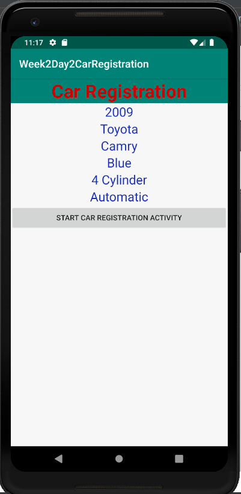

# Week2Daily2CarRegistration
Car Registration Activity and Intent

Homework Week Two Day Two: Car Registration Form

Coding
Create a car registration application.  
1. Create a parcelable object Car that holds the following data: Year, Make, Model, Color, EngineSize, TransmissionType
2. Create an activity that will display the last car entered.  
3. Have a button that will start an activity for result and start a CarResgisterationActivity.
4. CarResgisterationActivity should gather the info to make the Car object and pass it back to the displaying activity.
5. YOU MUST PASS USING THE OBJECT AND A BUNDLE.
6. Set the CarResgisterationActivity so that only one instance is ever active in any task.
7. Experiment with at least 10 different attributes for your views/viewgroups.

Instructions:

Run the Android project
- Create a new Virtual Device if not already. Then, choose Pixel 2 XL, then click OK.
- Click on the "Start Car Registration Activity" button.
- Fill out the Year, Make, Model, Color, Engine Size and Transmissioon Type of a Car.
- Once the form is completed, click on "Register Car".
- Finally, the enter car information is then displayed on the main activity.

